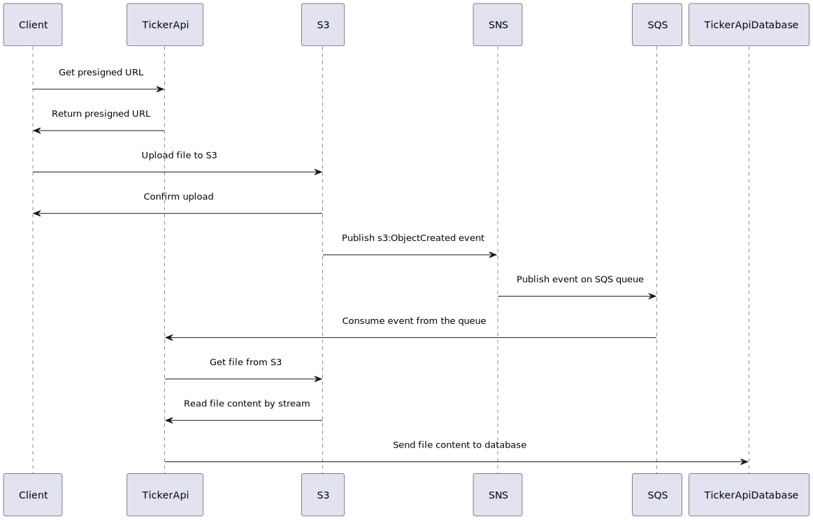

# TickerApi

TickerApi is a technical showcase project designed to demonstrate proficiency in scalable backend architectures, cloud-native patterns, and modern Elixir/Phoenix development. The API enables users to upload B3 stock quote files, which are then imported and processed efficiently into a database. The project is structured to tackle real-world challenges such as file ingestion, event-driven processing, and reliable data import pipelines.

---

## Architecture Overview

The system is composed of the following main components:

- **Phoenix API**: Handles HTTP requests, file uploads, and exposes endpoints for interacting with the service.
- **AWS S3 (LocalStack)**: Stores uploaded B3 stock quote files.
- **AWS SNS/SQS (LocalStack)**: Implements event-driven communication. When a file is uploaded to S3, an event is published to SNS, which then delivers a message to an SQS queue.
- **Broadway Worker**: Consumes messages from the SQS queue, processes the uploaded files, and imports data into the database using backpressure and concurrency control via GenStage.
- **PostgreSQL**: Stores the imported stock quote data.
- **Redis**: Caches all query results for fast retrieval and reduced database load.
- **Prometheus & Grafana**: Used for monitoring, metrics collection, and visualization of system performance and health.

All AWS services are emulated locally using [LocalStack](https://github.com/localstack/localstack) for development and testing.

---

## Sequence Diagram



1. **User uploads a B3 stock quote file via the API.**
2. **API uploads the file to S3.**
3. **S3 triggers an event, publishing a message to SNS.**
4. **SNS delivers the event to an SQS queue.**
5. **A Broadway worker consumes messages from SQS, processes the file, and imports data into PostgreSQL.**
6. **Query results are cached in Redis for performance.**
7. **System metrics are collected by Prometheus and visualized in Grafana.**

---

## Endpoints

### 1. Upload Stock Quotes File

- **POST** `/api/quotes/upload`
- **Description**: Upload a B3 stock quotes file (CSV or TXT).
- **Request**: `multipart/form-data` with a file field named `file`.
- **Response**: `201 Created` with a JSON body containing file metadata.

#### Example (using `curl`):

```bash
curl -F "file=@/path/to/B3_quotes.csv" http://localhost:4000/api/quotes/upload
```

### 2. List Imported Quotes

- **GET** `/api/quotes`
- **Description**: Retrieve a list of imported stock quotes.
- **Response**: `200 OK` with a JSON array of quotes.

### 3. Get Quote by Ticker

- **GET** `/api/quotes/:ticker`
- **Description**: Retrieve all quotes for a specific ticker.
- **Response**: `200 OK` with a JSON array of quotes for the ticker.

---

## Services & Libraries Used

- **[Elixir](https://elixir-lang.org/)** & **[Phoenix](https://www.phoenixframework.org/)**: Web API and business logic.
- **[Broadway](https://hexdocs.pm/broadway/readme.html)**: Concurrent and backpressured data ingestion from SQS.
- **[BroadwaySQS](https://hexdocs.pm/broadway_sqs/BroadwaySQS.html)**: SQS integration for Broadway.
- **[ExAws](https://hexdocs.pm/ex_aws/ExAws.html)**: AWS SDK for Elixir, used for S3 operations.
- **[LocalStack](https://github.com/localstack/localstack)**: Local AWS cloud stack for development.
- **[PostgreSQL](https://www.postgresql.org/)**: Relational database for persistent storage.
- **[Redis](https://redis.io/)**: In-memory cache for query results.
- **[Prometheus](https://prometheus.io/)**: Metrics collection and monitoring.
- **[Grafana](https://grafana.com/)**: Visualization of metrics and dashboards.
- **[Docker Compose](https://docs.docker.com/compose/)**: Orchestrates LocalStack, PostgreSQL, Redis, Prometheus, and Grafana containers.

---

## Running Locally

1. **Start all services (LocalStack, PostgreSQL, Redis, Prometheus, Grafana):**

   ```bash
   docker-compose up -d
   ```

2. **Setup Elixir dependencies:**

   ```bash
   mix setup
   ```

3. **Run database migrations:**

   ```bash
   mix ecto.setup
   ```

4. **Start the Phoenix server:**

   ```bash
   mix phx.server
   # or
   iex -S mix phx.server
   ```

5. **Access Grafana dashboards:**

   - Open [http://localhost:3000](http://localhost:3000) (default Grafana port).
   - Default credentials: `admin` / `admin`.

---

## Environment Variables

- `AWS_ACCESS_KEY_ID`, `AWS_SECRET_ACCESS_KEY`, `AWS_REGION`: Used for S3/SNS/SQS integration (pointing to LocalStack).
- `DATABASE_URL`: PostgreSQL connection string.
- `REDIS_URL`: Redis connection string.
- `PROMETHEUS_URL`: Prometheus endpoint for metrics scraping.

---

## Worker Details

The Broadway worker is responsible for:

- Consuming messages from the SQS queue.
- Downloading the uploaded file from S3.
- Parsing and importing the stock quotes into PostgreSQL.
- Caching query results in Redis.
- Handling failures and retries gracefully.

Backpressure and concurrency are managed automatically by Broadway and GenStage, ensuring efficient and reliable processing.

---

## Monitoring

- **Prometheus** collects metrics from the Phoenix application and Broadway pipeline.
- **Grafana** provides dashboards for visualizing system health, throughput, error rates, and other key metrics.

---

## Extending & Customizing

- **Add new endpoints** for analytics or reporting.
- **Integrate authentication** for secure uploads.
- **Deploy to AWS** by switching LocalStack endpoints to real AWS services.
- **Customize Grafana dashboards** for deeper insights.

---

## License

MIT

---

## Author

Luan Fellipe

---

## References

- [Phoenix Documentation](https://hexdocs.pm/phoenix)
- [Broadway Documentation](https://hexdocs.pm/broadway)
- [LocalStack Documentation](https://docs.localstack.cloud/)
- [Prometheus Documentation](https://prometheus.io/docs/)
- [Grafana Documentation](https://grafana.com/docs/)